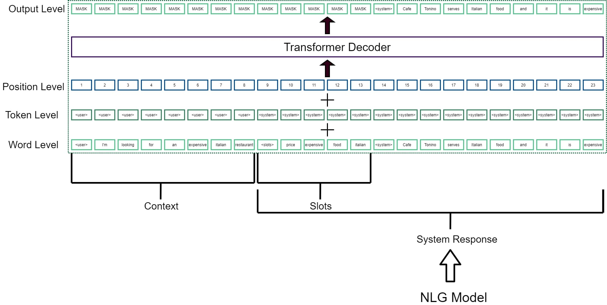

<h1>
    Conversational Artificial Intelligence
</h1>
<h3>
    Dhruv Sabharwal 
    Dr. Ravi Kothari 
</h3>
<h2>
    Introduction
</h2>
Conversational artificial intelligence refers to technologies like chatbots and voice assistants that users can talk to. Conversational systems have memory and can understand, process and respond to user inputs in a natural human-like way. Done well, conversational AI helps people interact with complex systems in faster and easier ways, and helps businesses deliver personalized engagements and support at scale. 
A conversational system has four components:
<ol>
    <li>
        <b>Input/Output modules -</b> These mainly comprise of the Automated Speech Recognition (ASR) engine and the Text To Speech (TTS) engine.
    </li>
    <li>
        <b>Natural Language Understanding module (NLU) -</b> This part of the conversational system is responsible for breaking down human langugage into machine readable form. In simple terms, the NLU tries to break down the user utterances into intents and entities.
    </li>
    <li>
        <b>Natural Language Generation module (NLG) -</b> The NLG module is concerned with the generation of human readable text from some data source. The NLG is responsible for not just producing syntactically correct sentences, but it also needs to make sure the generated text makes sense.
    </li>
    <li>
        <b>Dialog Management System -</b> This component of the conversational system is responsible for "guiding" the flow of the conversation. It uses the input from the NLU, decides how the conversation should proceed and accordingly directs the NLG what to output to the user.
    </li>
</ol>

<h2>
    Scope of the Project
</h2>
We look at two crucial modules of conversational systems - the Natural Language Understanding module and the Natural Language Generation module.
<ul>
    <li>
        Instead of designing separate models for intent and entity detection, we decided to create a multi-task model that can be jointly trained and optimized for both these tasks.
    </li>
    <li>
        We have developed a transformer based natural language generation model fit for task-oriented conversational systems. The transformer used is OpenAI’s GPT which has shown incredible capacity for text generation in recent times.  
    </li>
    <li>
        We use GPT, which has till now only been used for generation purposes, to also do the work of the NLU module i.e. a transformer is used to extract entities and intents from the input utterances. <b>(novel approach)</b>
    </li>
    <li>
        The NLU and NLG components are fused together into one conversational system. The dialog management system is completely discarded. The combination of NLU+NLG modules we have developed is robust enough to hold meaningful task-oriented conversations with the user. <b>(novel approach)</b>
    </li>
    <li>
        Finally, as a sample application, we have developed a restaurant information conversational system which can chat with the user in real time, and which confirms that our approach to conversational systems is indeed a promising one and worthy of future research.
    </li>
</ul>

<h2>Multi-Task Natural Language Understanding Model</h2>
We create a multi-task NLU model to extract the entities and intents from the user utterances. The model is adapted from <a href="https://arxiv.org/pdf/1811.05370.pdf">this</a> paper, with some changes. Our multi-task model has three components:
<ul>
    <li>
        <b>Intent extraction component -</b> This is a bidirectional LSTM which takes in the input embeddings and outputs the intent of the utterance using a linear layer.
    </li>
    <li>
        <b>Entity extraction component -</b> This is a bidirectional LSTM with a CRF layer on top. The output is of equal length as the input with an entity type for each input word.
    </li>
    <li>
        <b>Embedding component -</b> We use ELMo embeddings to convert the input words into machine understandable form. ELMo embeddings are context dependent and result in better performace when compared with our baseline Word2Vec and FastText embedding models.
    </li>
</ul>

<b>Overall Model - </b>The ELMo embedding component forms the base of the multi-task NLU model. The Intent and Entity recognition components sit on top of the ELMo component. The final BiLSTM layer of the ELMo module is trained as a shared BiLSTM between the Intent and Entity recognition components.  

<h3>Dataset and Metrics</h3>
<b>ATIS Dataset -</b>The Airline Travel Information System is a standard benchmark dataset. Train set: 4978 samples, 943 vocab size, 129 entities and 26 intents. Test set: 893 samples, 943 vocab size, 129 entities and 26 intents. 
<b>Metrics -</b>We calculate two metrics on the test set to measure the performance of our NLU model:  
Intent Classification Accuracy (ICA)  =  96.8 %  
Entity F1 Score  =  97.4 %  

<h2>GPT Based Natural Language Generation Model</h2>
We have used the GPT for the generative needs of our conversational system. GPT consists of a stack of 12 transformer decoder layers stacked one above the other. The GPT, which is suited for tasks like passage generation, is adapted to a conversational setting by making a few tweaks to the structure of data fed into the model.  

 
We have taken inspiration from two recent works on how to adapt GPT to a conversational setting.
<h3>Inspiration 1 - TransferTransfo Framework</h3>
Described in <a href="https://arxiv.org/pdf/1901.08149.pdf">this</a> paper, the TransferTransfo framework adds dialog state embeddings to the word embeddings, along with the positional embeddings of a vanilla transformer. This allows the system to recognize which part of the text is input from the user, and which part is generated by the system.  

 
The TransferTransfo framework is suitable for open domain conversations. We, however, are building a task-oriented conversational system and hence need to make some adjustments to the structure of TransferTransfo.

<h3>Inspiration 2 - Modified TransferTransfo Framework</h3>
The authors of <a href="https://arxiv.org/pdf/1907.05774.pdf">this</a> paper propose a method to convert the TransferTransfo framework into one suitable for task-oriented conversations. The authors concatenate the domain name, the belief state (the filled in slots), the database state (number of slots in the domain) and the conversation history to the input that is sent to the GPT, and the GPT produces the system output based on all this information.
 

 
At this point we had a strong foundation to proceed with the creation of our task-oriented restaurant information conversational system. We made two modifications to the model above.
<h3>Modification 1</h3>
The Belief state, being in the beginning of the conversation, is too far away from the current response and hence its effect is diminished on the response. We shift the belief state closer to the current response. Although transformers are position agnostic, the slots accumulated in the beginning of the input text made it difficult for the model to connect particular slots with the corresponding parts of the conversation history and also led to problems when the direction of the conversation was changed (for example, from cheap food to expensive food). This was noticed during our initial testing. After making the changes, the model was able to hold long properly directed conversations with the userand was also able to adapt well to abrupt changes in the conversation.
 

 
At this point there arose another problem. How do we fill the slots? The multi-task NLU model developed at the beginning of the project came to our rescue, and we quickly adapted it to our current domain. The NLU model succeeded in predicting the slots with high accuracy. In this way, the NLU and NLG models fused together into a robust task-oriented conversational system.
 

 
However, while using combination model worked well, it had a long inference time as the information needed to be passed through two separate neural networks. We came up with a novel way of solving this problem which enabled us to drastically cut down the average inference time from 1.8 seconds to 0.9 seconds on a GeForce MX150.
<h3>Modification 2</h3>
Another way to fill the slots, which we employ in our final model, is by making the NLG model itself fill the slots, i.e. make the NLG model do the job of the NLU model too. Though this sounds counter-intuitive, it works well in practice. The NLG model is able to predict the slots in the user inputs, and it generates a response based on these slots it has filled. Interestingly, we saw the performance of this new model surpass the NLU+NLG combination model.
 

<h3>Decoding Strategy</h3>
All generation models need to follow a particular decoding strategy which decides what token is to be predicted next. We experimented with a number of decoding strategies.
<ul>
    <li>
        <b>Greedy -</b> The token with the highest probability is predicted. This leads to less natural conversations. Another problem is that a high-probability token may be hiding after a low-probability token and may be missed.
    </li>
    <li>
        <b>Beam Search -</b> Tries to mitigate this issue by maintaining a beam of several possible sequences that we construct word-by-word. At the end of the process, we select the best sentence among the beams.
    </li>
    <li>
        <b>Random Sampling -</b> This randomly samples from all the tokens based on their probability. So, every token has a chance of getting predicted, but the ones with higher probability are more probable.
    </li>
    <li>
        <b>Top-K Sampling -</b> This takes the top K number of tokens which have the highest probability and samples from them.
    </li>
    <li>
        <b>Nucleus Sampling (Top-P Sampling) -</b> This takes the smallest set of the top V tokens, the sum of whose probabilities add up to P.
    </li>
</ul>
The graph below (adapted from <a href="">this</a> paper) shows the comparision of these decoding strategies with the choices a human being makes while generating text.
 

  
As evident from the graph, nucleus sampling is the best approach among the five and leads to utterances very similar to human language. We use this approach for decoding the next predicted token and use <em>P = 0.85</em>.

<h3>Dataset and our Application</h3>
We have created a conversational system which can be used to get information about restaurants in a particular city. The user can search using several filters like price range, cuisine type, area, etc. The user can also ask for information like phone number, address, postcode, etc., of the selected restaurant. 
<b>Dataset -</b> We created a custom dataset by combining the MultiWoz and Dstc2 datasets. The dataset has 2212 training samples, 706 validation samples and 816 testing samples. 
<b>Intents -</b> Two major intents with several sub-intents: Request and Inform. 
<b>Entities -</b>b> food type, price range, area, address, phone number, postcode, restaurant name and signature dish. 

<h2>Sample Conversations</h2>
<b>Note -</b> User utterance is in blue and system response is in green.
 

 

 

 

 

<h2>Conclusion and Future Work</h2>
The conversational model's performance exceeded expectations. Given how simple the architecture is, the way it was able to hold long conversations, remember user choices and act on them, showed great potential. The model was able to deal with tricky situations where the input was something unexpected and that showed its superiority to rule-based chatbots.  
Our model also had certain weaknesses: 
<ul>
    <li>
        The model is not able to generate phone numbers, postcodes and addresses correctly. For phone numbers it just utters a random string. This was expected as the system does not have a back-end database which the model can query to get the correct value.
    </li>
    <li>
        The model is not the most robust. While it can deal with minor deviations, completely unrelated utterances like “Show me the nearest gas station” lead to unpredictable results. This was expected as the model is trained on specifically on restaurant data and here too it cannot answer questions like “Does the restaurant serve ice-cream?”. Such samples are not present in the training dataset; however this information can be easily implemented using a few utterances with a has_dish intent if required in the future.
    </li>
    <li>
        The GPT model cannot support conversations longer than 512 tokens (words/subwords). This is not a big issue, as conversations are rarely that long. The 512 token limit is GPT’s inbuilt structure which cannot be bypassed.
    </li>
</ul>

There are a number of ways in which we can improve our model in the future. Future research in this direction should also be done keeping the following points in mind.
<ul>
    <li>
        Delexicalization - This means to remove actual examples of restaurant names, addresses, phone numbers, etc. with tokens of the form &lt;restaurant_name&gt;, &lt;address&gt;, &lt;phone_number&gt;, and so on. This can be done wither in the training dataset directly (preferred) or in the system response generated by the conversational system.
    </li>
    <li>
        Once delexicalization has been done, we can connect the model to a back-end database using API calls. This will make the model a truly end-to-end conversational system.
    </li>
    <li>
        A final way of improving the system is by using GPT-2 instead of GPT. GPT-2 has 1.5 B parameters, which is 10 times more than GPT. Using GPT-2 would lead to better performance, as has been shown for most other NLP tasks due to the larger number of parameters.
    </li>
</ul>

In this research project we were able to develop a restaurant information conversational system from scratch. Extensive knowledge has been gained about the working of state-of-the-art NLU and NLG models. The completion criteria that was decided at the start of the project has also been successfully met. We hope that this project can inform and guide future research in hope of simultaneously improving and simplifying the design of task-oriented conversational systems.
